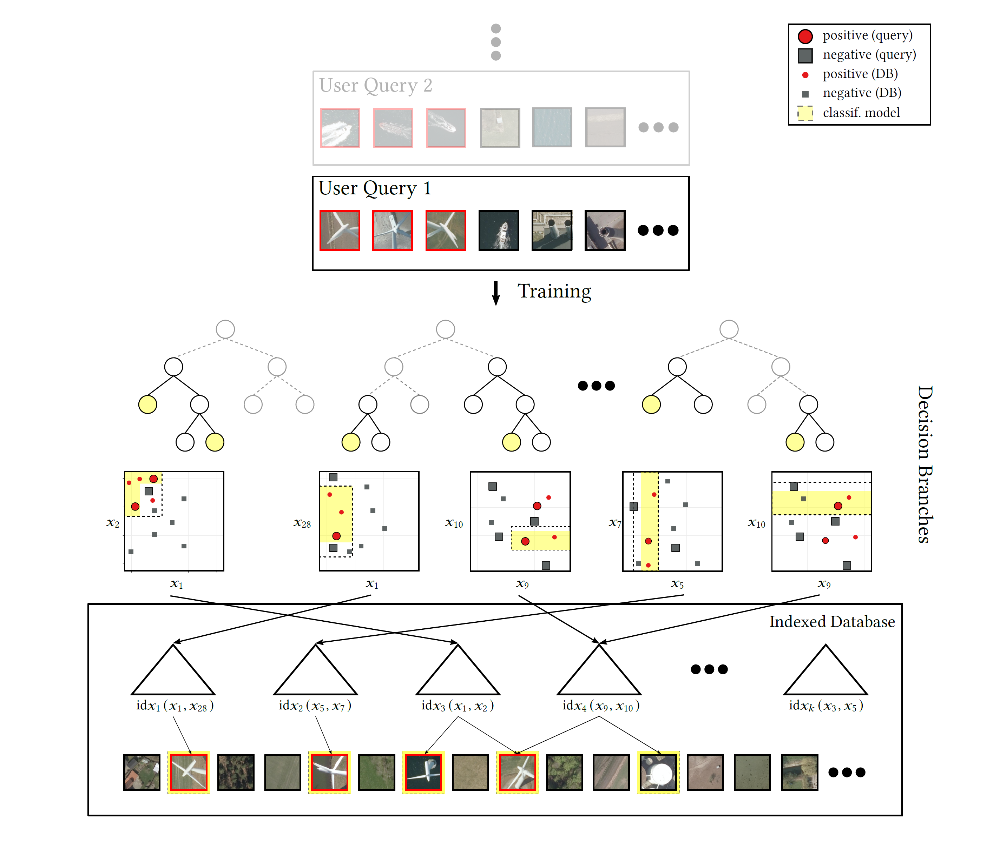
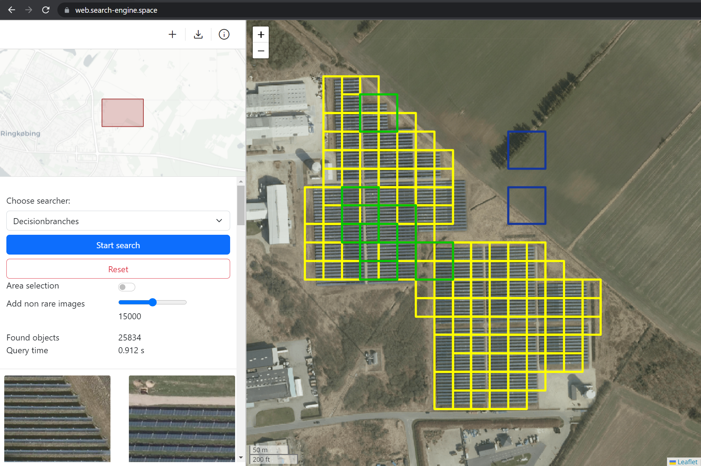

# Fast Search-By-Classification for Large-Scale Databases Using Index-Aware Decision Trees and Random Forests
This repository contains the source code for the paper *"Fast Search-By-Classification for Large-Scale Databases Using Index-Aware Decision Trees and Random Forests"*. We show that our *Search-by-Classification* model (see left figure) can heavily speed up rare-object searches in comparison to classic decision tree models. Unlike traditional approaches where the whole data needs to be scanned, our search approach instead uses multidimensional index structures to only load the relevant data. One use case for our search approach is looking for rare objects in massive catalogs of satellite imagery. In the right figure, we show the **prototype** of our approach embedded in an image search engine (**our prototype is available via this [link](https://web.rapid.earth/)**). In the example, we search for wind turbines (red rectangle) by selecting rare as well as some non-rare patches (purple rectangle) that should be excluded from the search. The response for our search is returned within seconds even for large data catalogs due to our index-supported query processing.

<p align="middle">
  <kbd>
    
  </kbd>
  <kbd>
    
  </kbd>
</p>

## Getting started
To run the code, **Python3.8** is required. To run the code, we provide you with three options:

1) Try out the first example in **Google Colab** (by clicking on the button on the right):
[](https://colab.research.google.com/github/decisionbranches/decisionbranches/blob/master/examples/pipeline.ipynb)

For the following options clone the repository first with:\
`git clone https://github.com/decisionbranches/decisionbranches.git`

2) **Virtual environment**:
```
python -m venv venv
source venv/bin/activate
pip install -r requirements.txt
pip install .
```

3) **Docker**:
```
docker build -t decisionbranches .
docker run --rm -it decisionbranches bash #Start container & start Bash in it
```

## Structure
The repository contains four directories. In `decisionbranches`, we include all source code required for the described decision branches models. We organize the code into Python and Cython components. The second part of our contribution includes the hybrid memory k-d trees whose implementation is located in the directory `py_kdtree`. Here, the compute-intensive parts implemented in Cython are moved to a subfolder. In `examples`, we provide you with multiple Python scripts for testing our developed methods. More information on that is given in the following section. The last directory `figures` contains all figures used within the repository.
```
├── decisionbranches 
│   ├── cython # cython modules for performance relevant components
│   ├── __init__.py
│   ├── models # Decision Branches model implementations
│   └── utils # utility functions
├── Dockerfile
├── examples
│   ├── full_experiments.py
│   ├── pipeline.ipynb
│   ├── pipeline.py
│   └── run_experiment.py
├── figures # Figures used within the repository
│   ├── figure.png
│   ├── pipeline.png
│   └── prototype_searchengine.png
├── py_kdtree
│   ├── cython # cython modules for performance relevant components
│   ├── __init__.py
│   ├── kdtree.py # Single k-d tree implementation
│   └── treeset.py # Set of k-d trees as treeset
├── README.md
├── requirements.txt
└── setup.py
``` 

## Examples: Decision Branches
In the `examples` folder, we provide three example use cases for our models. The file `pipeline.py` contains the source code for a full pipeline for the SatImage dataset. First, the k-d tree index structures are created and based on them the decision branches model is trained. The resulting boxes are used for querying the test data via the k-d tree index structures. A Jupyter Notebook version of this script can be found in `pipeline.ipynb` which can be directly opened in Google Colab.

In the file `run_experiment.py`, it is shown how to run experiments of the decision branch models (or sklearn tree models)
on specific datasets. We use an own wrapper function `run_experiment()` that takes care of the
whole experimental pipeline. Here, the model performance can be evaluated with different parameter configurations.

The file `full_experiments.py` contains all parameters relevant to reproduce the experiments for the model benchmark of our paper. Simply select the model configuration for your desired model and feed them into the function `run_experiment()`.

